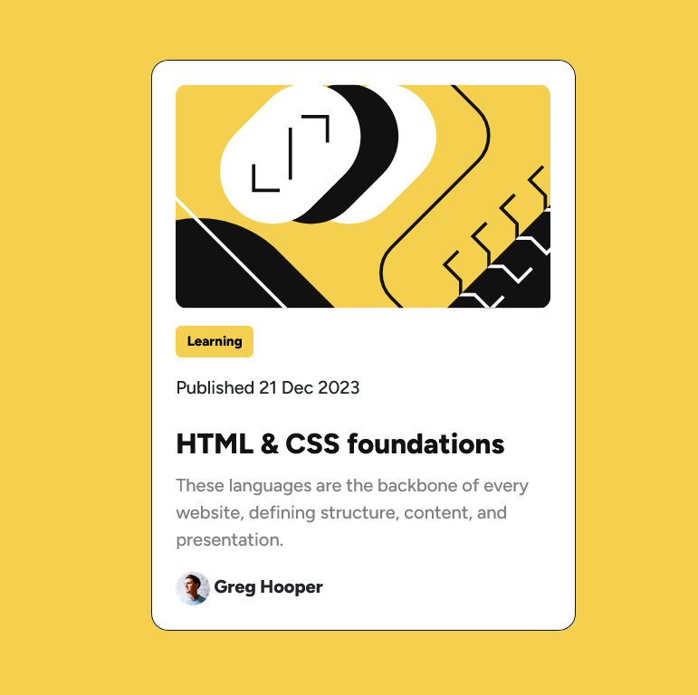

# Frontend Mentor - Blog preview card solution

This is a solution to the [Blog preview card challenge on Frontend Mentor](https://www.frontendmentor.io/challenges/blog-preview-card-ckPaj01IcS). Frontend Mentor challenges help you improve your coding skills by building realistic projects. 

## Table of contents

- [Overview](#overview)
  - [The challenge](#the-challenge)
  - [Screenshot](#screenshot)
  - [Links](#links)
- [My process](#my-process)
  - [Built with](#built-with)
  - [What I learned](#what-i-learned)
  - [Continued development](#continued-development)
  - [Useful resources](#useful-resources)
- [Author](#author)

## Overview

### The challenge

Your challenge is to build out this blog preview card and get it looking as close to the design as possible.

Users should be able to:

- See hover and focus states for all interactive elements on the page

### Screenshot



### Links

- Solution URL: [Add solution URL here](https://your-solution-url.com)
- Live Site URL: [Add live site URL here](https://your-live-site-url.com)

## My process

### Built with

- Semantic HTML5 markup
- CSS custom properties
- Flexbox
- [Bootstrap](https://getbootstrap.com/) - CSS Framework

### What I learned

If you add your style sheet after the Bootstrap CND then it will overwrite the styles.
```html
  <link href="https://cdn.jsdelivr.net/npm/bootstrap@5.3.3/dist/css/bootstrap.min.css" rel="stylesheet" integrity="sha384-QWTKZyjpPEjISv5WaRU9OFeRpok6YctnYmDr5pNlyT2bRjXh0JMhjY6hW+ALEwIH" crossorigin="anonymous">
  <script src="https://cdn.jsdelivr.net/npm/bootstrap@5.3.3/dist/js/bootstrap.bundle.min.js" integrity="sha384-YvpcrYf0tY3lHB60NNkmXc5s9fDVZLESaAA55NDzOxhy9GkcIdslK1eN7N6jIeHz" crossorigin="anonymous"></script>

  <link rel="stylesheet" href="./css/main_stylesheet.css">
```

To center a div you can can use the following code below, but you have to specify a height. 
```css
main {
    height: 668px;
    display: flex;
    align-items: center;
    justify-content: center;
}
```

### Continued development

- Utilize Bootstrap more by implementing components into my projects
- Learn more about widely used CSS Frameworks

### Useful resources

- [Bootstrap](https://getbootstrap.com/docs/5.3/components/card/) - Details about Card Component
- [Stack Overflow](https://stackoverflow.com/questions/8596794/customizing-bootstrap-css-template) - This helped me figure out how to overwrite the styles (font, colour, border, etc...) for Bootstrap components

## Author

- Website - [Natasha Chambers Portfolio](https://natashaagathachambers.com/)
- Frontend Mentor - [@NatashaAC](https://www.frontendmentor.io/profile/NatashaAC)
